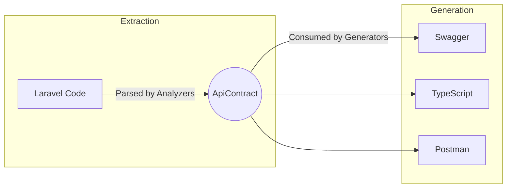

# The API Contract (`ApiContract`)

The `ApiContract` object is the pulsating heart of the `laravel-api-contract` package. It represents a strict, platform-agnostic, intermediate representation of your entire Laravel application's API.

This document details its internal structure, its philosophy as the "single source of truth," and how it interfaces with the generators.

---

## 1. What is the `ApiContract`?

When you run `php artisan api-contract:build`, the package's analyzer engine scans your application's routes, controllers, form requests, and resources. Instead of generating Swagger or TypeScript directly, it compiles all of this extracted metadata into a single object in memory: the `ApiContract`. 

This object is then serialized to disk (typically as `storage/api-contract.json`).

## 2. Why it Exists & The Single Source of Truth

By introducing a standardized intermediate layer, we decouple the **extraction phase** from the **generation phase**.



**Why is this critical?**
- **Single Source of Truth:** `ApiContract` guarantees that the TypeScript generator, the Swagger generator, and the Test generator are all looking at the *exact same underlying data*. There is zero risk of the TypeScript types differing from the OpenAPI schema.
- **Extensibility:** If a developer wants to write a custom generator (e.g., a Swift code generator for iOS), they do not need to understand Laravel's Reflection APIs. They simply read the `ApiContract` JSON structure.
- **Historical Comparison:** By saving the `ApiContract` to disk on every deployment, we can compare the `new-contract.json` against `old-contract.json` to detect breaking changes programmatically.

---

## 3. Internal Structure

The `ApiContract` is fundamentally a collection of Endpoints and global Metadata.

```php
class ApiContract implements ApiContractContract
{
    /** @var array<int, EndpointDefinition> */
    public array $endpoints;

    public string $version;
    
    // ...
}
```

### 3.1 Metadata & Versioning

The `version` string allows you to stamp the contract with your application's current API version (e.g., `v1.0.0`). This is crucial for tracking breaking changes over time. Additional global metadata, such as the application name and base URL, can also be attached to the root level of the contract.

---

## 4. Endpoint Definitions

The bulk of the contract is an array of `EndpointDefinition` instances. An `EndpointDefinition` merges together everything known about a specific route.

```php
class EndpointDefinition
{
    public string $method;
    public string $uri;
    public string $name;
    
    public ControllerDefinition $controller;
    public ?RequestDefinition $request;
    public ?ResourceDefinition $resource;
    
    /** @var array<int, string> */
    public array $middlewares;
}
```

### 4.2 Middleware & Authentication Definitions

The `middlewares` array stores the middleware assigned to the route. This is primarily used to deduce the **Authentication Definition**. 

For example, if the endpoint contains `auth:sanctum` or `auth:api`, generators can infer that the endpoint is secured. The Swagger generator uses this to apply a security bearer token requirement, and the API Client generator uses this to inject authorization headers automatically.

---

## 5. DTO Breakdown

### 5.1 Request Definitions (`RequestDefinition`)

If the controller method accepts a `FormRequest`, the analyzer populates the `$request` property. The `RequestDefinition` holds an array of `ValidationField`s mapping out the required inputs.

```json
"request": {
    "fields": [
        {
            "name": "email",
            "type": "string",
            "required": true,
            "nullable": false,
            "rules": ["email", "unique:users"]
        },
        {
            "name": "age",
            "type": "integer",
            "required": false,
            "nullable": true,
            "rules": ["min:18"]
        }
    ]
}
```

### 5.2 Resource Definitions (`ResourceDefinition`)

If the controller returns a `JsonResource`, the analyzer populates the `$resource` property. It maps exactly what fields are returned to the client.

```json
"resource": {
    "resourceClass": "App\\Http\\Resources\\UserResource",
    "collection": false,
    "fields": [
        {
            "name": "id",
            "type": "integer",
            "nullable": false
        },
        {
            "name": "email",
            "type": "string",
            "nullable": false
        }
    ]
}
```

---

## 6. Serialization

The `ContractSerializer` handles converting the in-memory `ApiContract` object to a standard JSON string and back again. 

When generating the JSON representation, `ContractSerializer` validates all output paths using a strict `ensureSafePath` mechanism to prevent directory traversal attacks.

```php
// Reading an existing contract from disk
$serializer = app(ContractSerializer::class);
$contract = $serializer->fromFile(storage_path('api-contract.json'));

// Writing the contract to disk
$serializer->toFile($contract, storage_path('api-contract.json'));
```

---

## 7. How Generators Consume the ApiContract

Generators are entirely unaware of Laravel. They accept the `ApiContract` object and iterate over its structure to emit their respective artifacts.

### Swagger/OpenAPI Generator
Loops over `$contract->endpoints`.
1. Maps `$endpoint->uri` to OpenAPI paths.
2. Checks `$endpoint->middlewares` for auth requirements.
3. Maps `$endpoint->request->fields` to OpenAPI request bodies or query parameters.
4. Maps `$endpoint->resource->fields` to OpenAPI JSON response schemas.

### TypeScript Generator
Loops over `$contract->endpoints`.
1. Extracts unique `$endpoint->request` and `$endpoint->resource` structures.
2. Generates TypeScript `interface` blocks. For instance, an `integer` field maps to a TypeScript `number`. A `nullable` field appends `| null` to the type.

### Typed Client Generator
Loops over `$contract->endpoints`.
1. Group endpoints by their prefix or controller (e.g., `UserService`).
2. Creates functional wrappers (e.g., `async store(payload: StoreUserRequest): Promise<UserResource>`).
3. Uses the authentication definition to decide whether to append token interceptors to the generated Axios/Fetch client.

### Test Generator
Loops over `$contract->endpoints`.
1. Scaffolds a PHPUnit test class for the controller.
2. Looks at `$endpoint->method` (e.g., `POST`) and `$endpoint->request->fields` to generate a valid dummy payload for the test.
3. Writes assertions checking that the response structure matches `$endpoint->resource->fields`.
