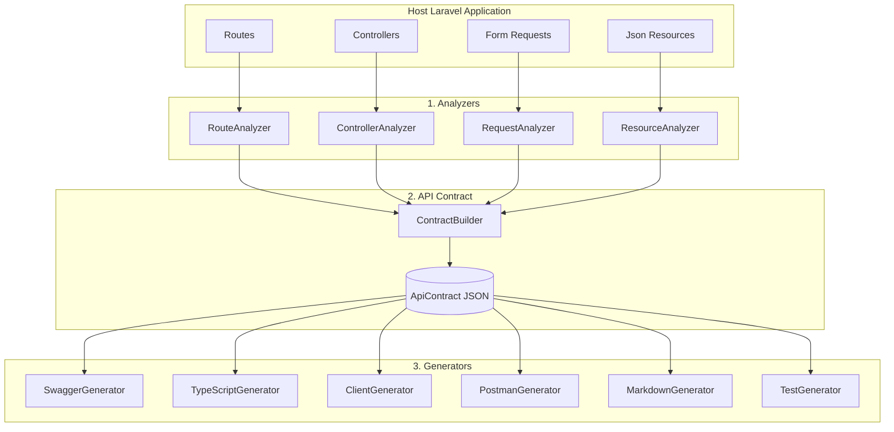

# System Architecture

This document details the complete internal architecture of the `laravel-api-contract` package. It is designed to help future contributors understand how data flows through the system, the responsibility of each layer, and where to make changes or extend functionality.

---

## 1. Overall Architecture

The package operates on a linear, unidirectional **Pipeline Architecture**:

1. **Extraction (Analyzers):** The system scans the host Laravel application's router, controllers, form requests, and resources using Reflection and AST (Abstract Syntax Tree) parsing.
2. **Standardization (Contract):** The extracted metadata is compiled into a single, unified intermediate representation known as the **API Contract** (`ApiContract` class / JSON file).
3. **Generation (Generators):** The API Contract is fed into multiple independent generators to emit artifacts (Swagger, TypeScript, Postman, Tests, Markdown).

---

## 2. Layered Architecture & Package Structure

The package is strictly divided into focused, decoupled layers inside the `src/` directory.

### `src/Analyzers` (The Extraction Layer)
Responsible for reading the host Laravel application's code and returning standard DTOs.
- `RouteAnalyzer.php`: Inspects Laravel's `Route` facade to gather all registered API routes, methods, and URIs.
- `ControllerAnalyzer.php`: Uses PHP Reflection to inspect the controller bound to a route to determine the exact method being invoked.
- `RequestAnalyzer.php`: Analyzes the `rules()` method of a given `FormRequest` to extract validation logic.
- `ResourceAnalyzer.php`: Caches and parses the `toArray()` method of `JsonResource` classes to detect the exact shape and relationships of the API response.

### `src/Config` (The Configuration Layer)
- `Configuration.php`: Provides a unified interface to read package configuration values (from `config/api-contract.php`). It also contains critical security methods, such as `ensureSafePath`, which prevents directory traversal vulnerabilities across all generators.

### `src/Console` (The CLI Layer)
Contains the Artisan commands exposed to the host application. These commands orchestrate the analyzers and generators but contain *no business logic* themselves.
- `BuildCommand.php`: Orchestrates the `ContractBuilder` to create the master contract.
- `CompareCommand.php`: Loads two contracts and runs them through the `ContractComparator` to generate a diff report.
- `SwaggerCommand.php`: Injects the `SwaggerGenerator` and writes the output.
- `TypeScriptCommand.php`: Injects the `TypeScriptGenerator` and writes interface files.
- `ClientCommand.php`: Injects the `ClientGenerator` and writes API client files.
- `PostmanCommand.php`: Injects the `PostmanGenerator` and writes the Postman collection.
- `MarkdownCommand.php`: Injects the `MarkdownGenerator` and writes Markdown documentation.
- `TestCommand.php`: Injects the `TestGenerator` and writes PHPUnit test stubs.
- `InstallCommand.php`, `ControllersCommand.php`, `RequestsCommand.php`, `ResourcesCommand.php`, `RoutesCommand.php`: Administrative/debugging commands.

### `src/Contracts` (The Interface Layer)
Contains pure PHP interfaces. By programming to interfaces rather than concrete implementations, the package allows developers to swap out core components via Laravel's Service Container if they need bespoke behavior.
- Examples: `ApiContractContract.php`, `ContractBuilderContract.php`, `ResourceAnalyzerContract.php`, etc.

### `src/Services/DTO` (The Data Transfer Object Layer)
These classes represent strictly typed data structures passed between layers.
- `RouteDefinition.php`: Holds URI and HTTP method.
- `ControllerDefinition.php`: Holds the resolved class and method name.
- `ValidationField.php`: Represents a single validation rule (e.g., `email`, `required`).
- `RequestDefinition.php`: Holds a collection of `ValidationField`s.
- `ResponseField.php`: Represents a single output property (e.g., `id`, `created_at`).
- `ResourceDefinition.php`: Holds a collection of `ResponseField`s.
- `ControllerCollection.php`, `RouteCollection.php`: Strongly typed collection wrappers.

### `src/Services/Contract` (The Contract Layer)
- `EndpointDefinition.php`: The master compilation of a single API route. It merges the `RouteDefinition`, `ControllerDefinition`, `RequestDefinition`, and `ResourceDefinition` into one coherent object.
- `ApiContract.php`: The root class representing the entire API. It is simply a collection of `EndpointDefinition` instances along with metadata (like API version).

### `src/Services` (The Business Logic Layer)
Houses the core orchestration logic and builders.
- `ContractBuilder.php`: The "brain" of the extraction phase. It injects all the analyzers, loops through the routes, and builds the final `ApiContract`.
- `Comparison/ContractComparator.php`: Contains the algorithm to detect breaking changes (e.g., missing endpoints, new required fields, changed types) by deep-diffing two `ApiContract` instances. Returns a `ChangeReport`.
- `Comparison/ApiChange.php`: Represents a single difference (breaking or non-breaking) found during comparison.
- `[Output]Builder.php`: Sub-builders that format data for specific generators (e.g., `OpenApiBuilder.php`, `TypeScriptBuilder.php`).

### `src/Generators` (The Output Layer)
Each folder here represents an independent artifact generator. Generators consume the `ApiContract` and return strings (or arrays of files) to be saved by the Console layer.
- `Swagger/SwaggerGenerator.php`: Orchestrates OpenAPI JSON generation.
- `Swagger/SchemaGenerator.php`: Handles complex OpenAPI schema and `$ref` generation.
- `TypeScript/TypeScriptGenerator.php`: Converts PHP types to TypeScript interfaces.
- `Client/ClientGenerator.php`: Generates Axios/Fetch client service classes.
- `Postman/PostmanGenerator.php`: Generates Postman v2.1 compatible JSON.
- `Markdown/MarkdownGenerator.php`: Iterates over endpoints to create GitHub-flavored markdown.
- `Test/TestGenerator.php`: Scaffolds PHPUnit feature tests based on expected inputs and outputs.

### `src/Support` (The Utility Layer)
Contains stateless helper classes and serializers.
- `ContractSerializer.php`: Handles serializing the `ApiContract` object to JSON and hydrating it back from JSON to the object. It includes security path validation when reading/writing.
- `ResourceParser.php`: The AST parser that parses `toArray()` bodies into arrays of keys and values.
- `ValidationRuleParser.php`: Converts string-based or array-based Laravel validation rules into strict types.
- `TypeScriptTypeMapper.php`: Maps PHP/Laravel primitive types to TypeScript types.
- `Facades/ApiContract.php`: Exposes the package API nicely for users preferring facades.

### `src/Providers`
- `LaravelApiContractServiceProvider.php`: Bootstraps the package. Registers configuration, Artisan commands, and binds all Interfaces in `src/Contracts` to their concrete implementations in the Laravel Service Container.

---

## 3. How Data Flows (Step-by-Step Execution)

To understand how the package works, trace the execution of `php artisan api-contract:build`:

1. **Invocation:** The user runs the Artisan command, which hits `BuildCommand::handle()`.
2. **Building the Contract:** The command calls `ContractBuilder::build()`.
3. **Route Extraction:** `ContractBuilder` calls `RouteAnalyzer::analyze()`. This returns an array of `RouteDefinition`s.
4. **Iterative Analysis:** For every `RouteDefinition`:
    - `ContractBuilder` passes it to `ControllerAnalyzer`, which finds the controller and returns a `ControllerDefinition`.
    - It passes the `ControllerDefinition` to `RequestAnalyzer` to extract form request validation into a `RequestDefinition`.
    - It passes the `ControllerDefinition` to `ResourceAnalyzer` to parse the JSON resource into a `ResourceDefinition`.
5. **Merging:** `ContractBuilder` merges these four definitions into a single `EndpointDefinition`.
6. **Finalization:** The `EndpointDefinition` array is wrapped in an `ApiContract` object.
7. **Serialization:** `ContractSerializer` writes the `ApiContract` object to disk as `api-contract.json`.

Later, when the user runs a generator like `php artisan api-contract:typescript`:

1. **Deserialization:** The command reads `api-contract.json` from disk using `ContractSerializer::fromFile()`, hydrating it back into an `ApiContract` object.
2. **Generation:** The command passes the `ApiContract` object to the `TypeScriptGenerator`.
3. **Writing Output:** The generator maps the types and returns file contents, which the command then securely writes to the user's `/resources/ts` directory.

---

## 4. Design Principles for Contributors

When contributing to this package, please adhere to these architectural rules:

- **Immutability:** DTOs (Data Transfer Objects) should be read-only where possible. Once an endpoint is defined, its structural properties should not mutate.
- **Single Responsibility Principle (SRP):** Analyzers only analyze. Generators only generate. Commands only interact with the console. Do not mix I/O operations (like `file_put_contents`) into Generators; return the content and let the Command handle the disk write.
- **Security:** Any I/O operations involving file paths must run through `Configuration::ensureSafePath($path)` to prevent directory traversal attacks.
- **Fail Gracefully:** If a controller is highly complex or uses a non-standard paradigm, an Analyzer might fail to parse it. It should return `null` or a generic representation rather than throwing a fatal exception, so the rest of the API can still be generated.
