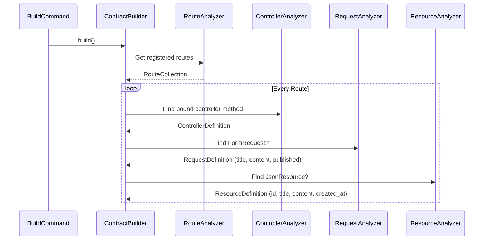
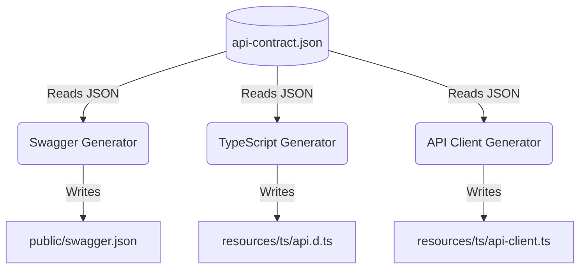

# Lifecycle Walkthrough: How It Works Under the Hood

To truly understand the power of `laravel-api-contract`, it helps to see the entire lifecycle in chronological order. 

This walkthrough takes you step-by-step through the journey of a single API endpoint. We will start from an empty Laravel project, write standard Laravel code, and watch how the package extracts, compiles, and generates artifacts.

---

## 1. The Developer Experience (Writing Code)

Imagine we are building a simple blogging API. A developer needs to create an endpoint to store a new `Post`.

They write standard, idiomatic Laravel code—**no custom annotations, no special package interfaces, no YAML files.**

### Step 1.1: The Route
They register the route in `routes/api.php`:
```php
Route::post('/posts', [PostController::class, 'store'])->middleware('auth:sanctum');
```

### Step 1.2: The Form Request
They define validation rules for the incoming payload in `StorePostRequest.php`:
```php
public function rules(): array
{
    return [
        'title' => 'required|string|max:255',
        'content' => 'required|string',
        'published' => 'boolean',
    ];
}
```

### Step 1.3: The JSON Resource
They define the structure of the API response in `PostResource.php`:
```php
public function toArray($request): array
{
    return [
        'id' => $this->id,
        'title' => $this->title,
        'content' => $this->content,
        'created_at' => $this->created_at->toIso8601String(),
    ];
}
```

### Step 1.4: The Controller
They tie it together in `PostController.php`:
```php
public function store(StorePostRequest $request)
{
    $post = Post::create($request->validated());
    return new PostResource($post);
}
```

That's it. The developer's job is done. Now, the package takes over.

---

## 2. The Extraction Phase (Analyzers)

When the developer runs `php artisan api-contract:build`, the package's engine springs into action.



### 2.1 Route & Controller Analysis
The `RouteAnalyzer` hooks into Laravel's Router facade, isolating `POST /api/posts`. It passes this to the `ControllerAnalyzer`, which uses PHP Reflection to inspect `PostController::store`.

### 2.2 Form Request Analysis
The `RequestAnalyzer` sees that the `store` method type-hints `StorePostRequest`. It instantiates the request and calls the `rules()` method. It parses the array, translating `required|string|max:255` into strongly-typed `ValidationField` DTOs.

### 2.3 Resource Analysis (AST Parsing)
The `ResourceAnalyzer` is the smartest part of the engine. It reads the source code of `PostController::store` and detects that it returns `new PostResource(...)`. It then reads the source code of `PostResource::toArray()`, parses the Abstract Syntax Tree (AST), and extracts the exact returned array keys (`id`, `title`, `content`, `created_at`).

---

## 3. The Compilation Phase (ApiContract)

Once the analyzers have extracted all the disparate pieces, the `ContractBuilder` merges them into a single, unified `EndpointDefinition`.

This definition encapsulates everything known about `POST /api/posts`:
- Method: `POST`
- URI: `/api/posts`
- Authenticated: `true` (deduced from `auth:sanctum`)
- Required Inputs: `title` (string), `content` (string)
- Optional Inputs: `published` (boolean)
- Response Payload: `id` (integer), `title` (string), `content` (string), `created_at` (string)

The builder repeats this for *every* route in your application, pushing all definitions into the master `ApiContract` object.

Finally, the `ContractSerializer` safely writes this massive object to disk as `storage/api-contract.json`. **This file is now the absolute Single Source of Truth.**

---

## 4. The Generation Phase

With the contract built, generators can now consume it to produce various outputs. Generators do not use Reflection, nor do they care that the backend is written in Laravel. They only read the JSON contract.



### Scenario A: Generating TypeScript (`php artisan api-contract:typescript`)
1. The command reads `api-contract.json`.
2. The `TypeScriptGenerator` iterates over the endpoints.
3. It finds the `/api/posts` endpoint and converts the `RequestDefinition` and `ResourceDefinition` into TypeScript interfaces:

```typescript
export interface StorePostRequest {
    title: string;
    content: string;
    published?: boolean;
}

export interface PostResource {
    id: number;
    title: string;
    content: string;
    created_at: string;
}
```
4. It writes these files securely to your frontend directory.

### Scenario B: Generating the API Client (`php artisan api-contract:client`)
1. The `ClientGenerator` looks at the `/api/posts` endpoint.
2. It sees that the endpoint requires authentication (`auth:sanctum`).
3. It scaffolds a TypeScript Axios/Fetch class specifically for the `PostController` that enforces the types generated in Scenario A:

```typescript
import { StorePostRequest, PostResource } from './types';
import axios from 'axios';

export class PostService {
    public static async store(payload: StorePostRequest): Promise<PostResource> {
        const response = await axios.post('/api/posts', payload, {
            headers: {
                'Authorization': `Bearer ${localStorage.getItem('token')}`
            }
        });
        return response.data;
    }
}
```

### Scenario C: Generating Swagger (`php artisan api-contract:swagger`)
1. The `SwaggerGenerator` converts the endpoint into OpenAPI v3.0 syntax.
2. It maps the URI, the `requestBody` schema (required fields, types), the `responses` schema, and applies a `security` requirement based on the middleware.
3. The resulting `swagger.json` file can immediately be loaded into Swagger UI or Redoc.

---

## 5. The Evolution Phase (Breaking Changes)

Fast-forward three months. The developer decides to remove the `title` field from `PostResource` because the frontend no longer displays it.

1. The developer deletes `'title' => $this->title` from the PHP code.
2. They run `php artisan api-contract:compare --old=storage/old-contract.json --new=storage/new-contract.json`.
3. The `ContractComparator` engine kicks in. It diffs the two JSON files.
4. It detects that a previously available output field (`title`) has vanished.
5. It throws a **BREAKING CHANGE** alert directly in the terminal, warning the developer that the frontend might crash if this code is deployed.

---

## Summary

By observing standard Laravel conventions, `laravel-api-contract` creates a frictionless pipeline:

**Code** ➔ **Analyzers** ➔ **Contract (JSON)** ➔ **Generators** ➔ **Output Artifacts**

This fully automated lifecycle guarantees that documentation never drifts, frontends are always type-safe, and breaking changes are caught before they reach production.
